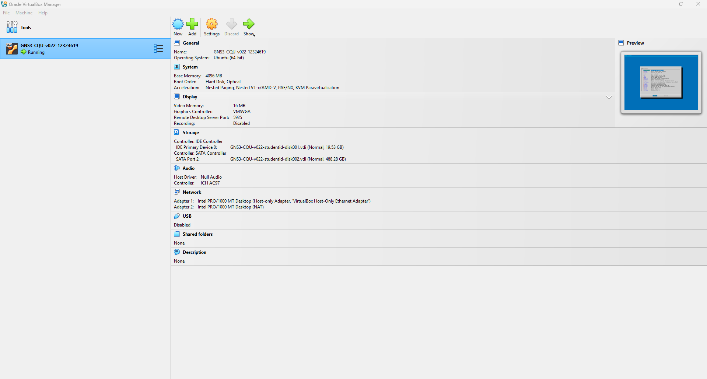
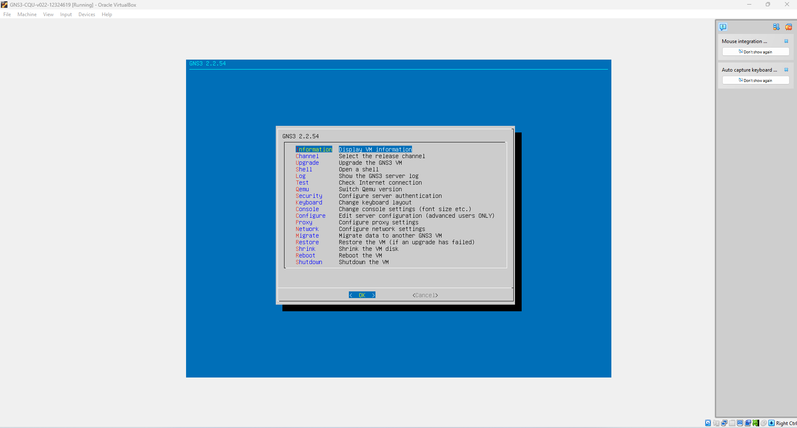
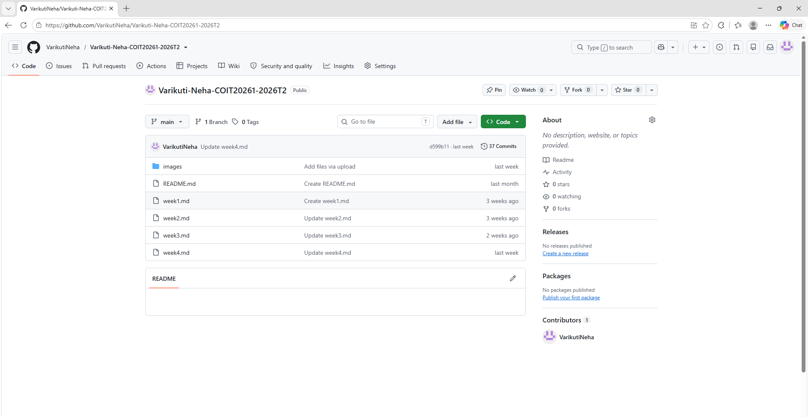
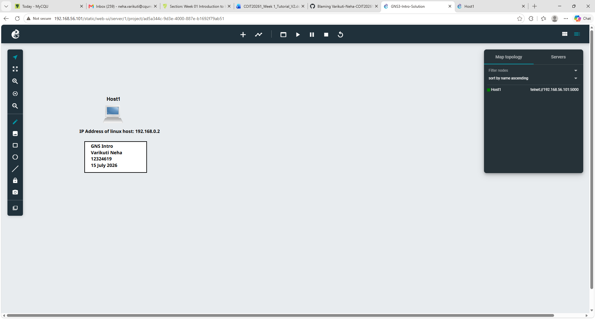

### **PORTFOLIO**
**Name:** Neha    
**StudentID:** 12324619    

--------------------------------------------------

**1. Understand the Unit:**

**Review the unit profile to understand the unit and its assessment tasks.**
- Done

---------------------------------------------------

**2. Software Setup:**
   
**GNS 3 (network simulator tool)**
    

The below screenshot is a representation of the working of the GNS3 virtual machine on VirtualBox. I worked on the GNS3 VM console and got an understanding of the options available in it.   

**VirtualBox (virtualization software)**

This screenshot shows the configuration of the GNS3 virtual machine in VirtualBox. I checked the allocated memory, storage, and network adapters and learned how the virtual machine is configured to support GNS3.    

-----------------------------------------

**3. GitHub Repository:**

    

This screenshot shows my GitHub repository for the COIT20261 unit. I used the repository to organise my weekly portfolio files and learned how GitHub can be used to store and manage my coursework.    

**Share the repository with your tutor.**    
- Done

--------------------------------------------

## **TASK 1: Introduction to GNS3 Basics**    

    

This screenshot shows my GNS3 project with a Linux host and the required project information and IP address annotations. I learned how to create a basic GNS3 topology, add a host, and document the network configuration.

    

This image illustrates the Linux console output which displays the network interface details. Using the "ip address" command, I was able to confirm that the IP address assigned to the interface eth0 was 192.168.0.2/24. This enabled me to learn about verifying the IP address in Linux.

