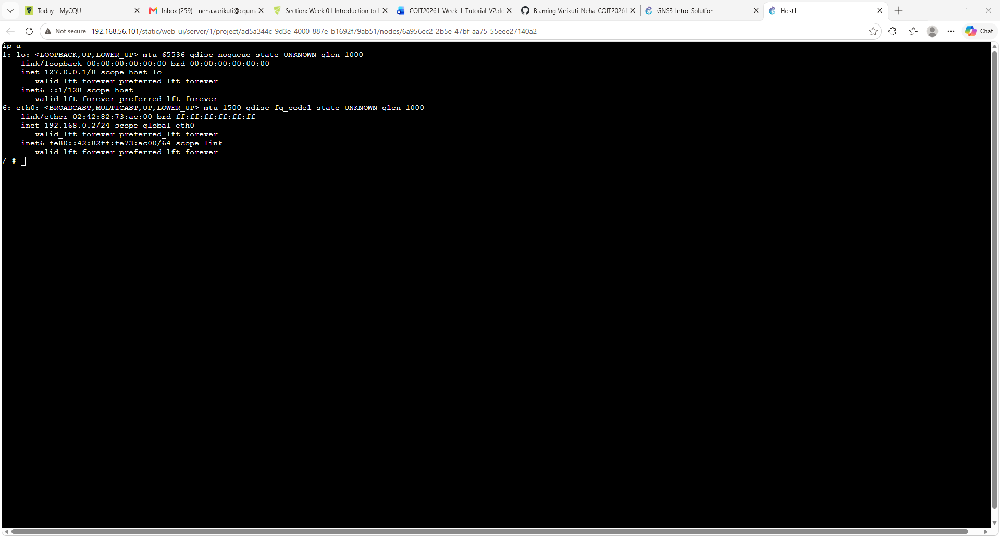

PORTFOLIO
2324619 - COIT20261 - 2026T2
1. Understand the Unit:

· Review the unit profile to understand the unit and its assessment tasks.
- Done

2. Software Setup:

· Check if you have the necessary software installed on your computer:
· VirtualBox (virtualization software)

· GNS 3 (network simulator tool)

3. GitHub Repository:

· Create a private GitHub repository named [student number]-[COIT20261]-[2026T2] for this unit.

· Share the repository with your tutor.
done

TASK 1
Screenshot of the network, e.g., GNS-Intro-<studentid>-network.png

Screenshot of the console showing the IP address, e.g., GNS-Intro-<studentid>-ipaddress.png

