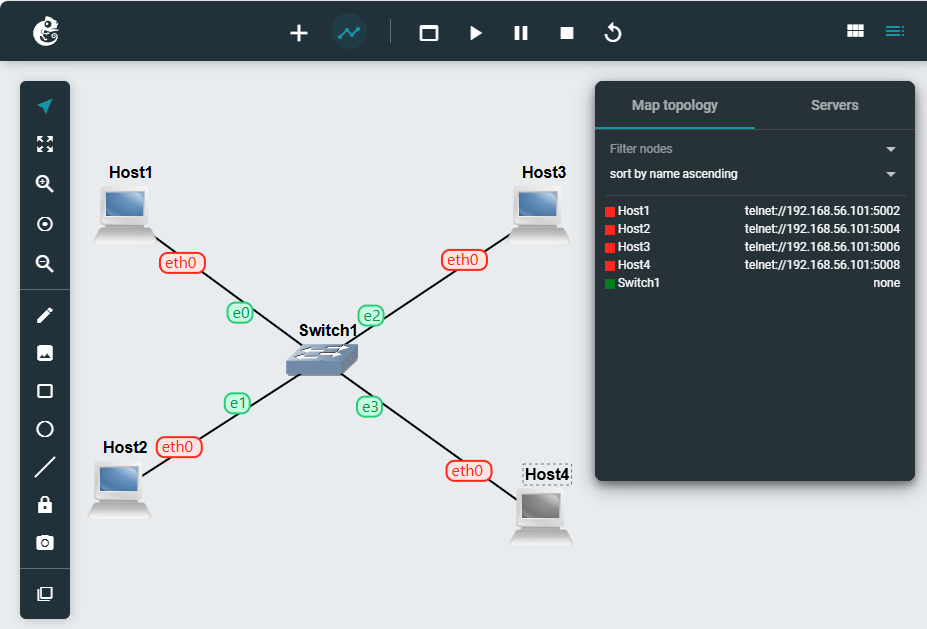
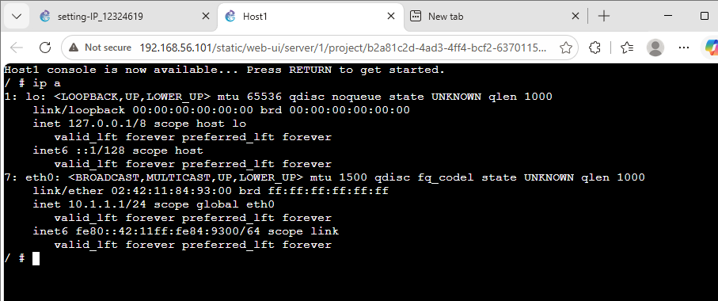
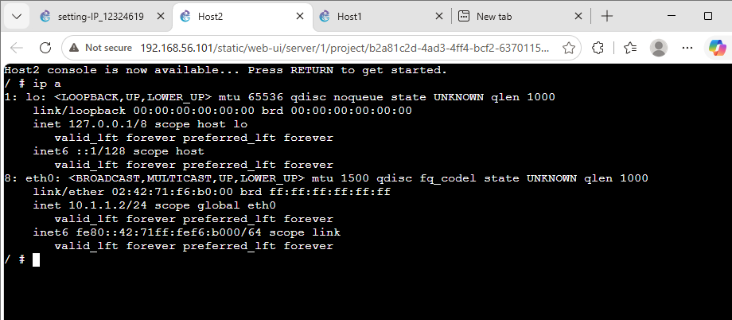
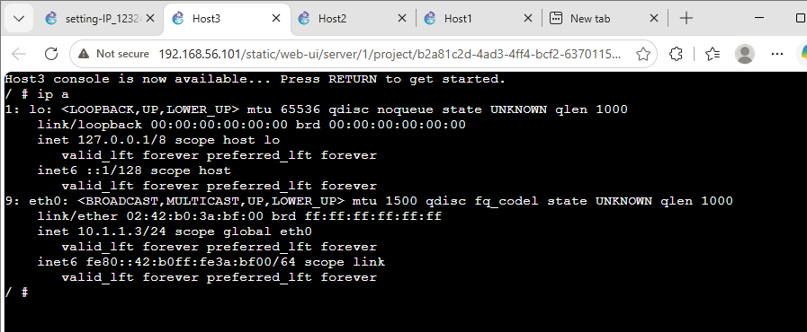
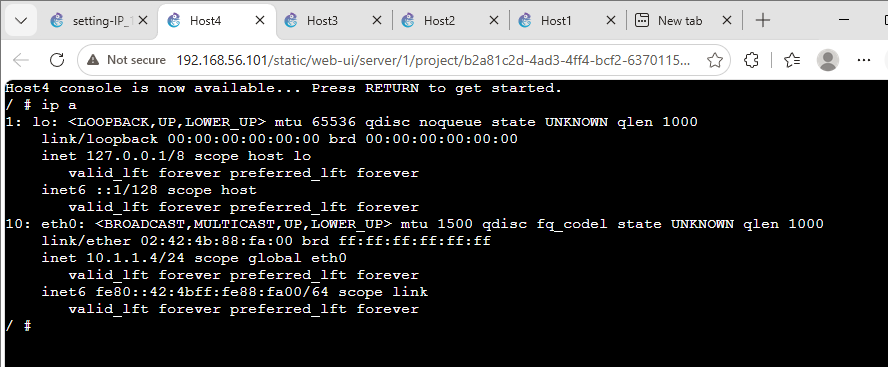
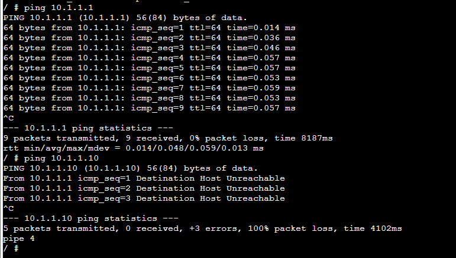
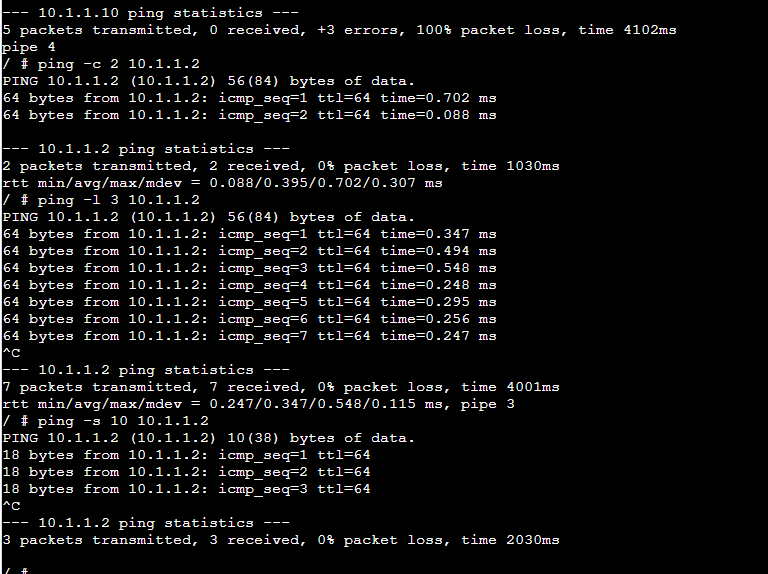

## **Task 1: Setting Static IP Addresses**     

**Network Topology**
    

This screenshot shows four Linux hosts connected to one Ethernet switch, forming a LAN. The topology demonstrates that all four hosts are connected through the same switch and are configured to communicate within the 10.1.1.0/24 network.    

**Host1 IP Address**
    

This screenshot shows the ip a output for Host1. The eth0 interface has the IP address 10.1.1.1/24, confirming that the static IP address was successfully configured.     

**Host2 IP Address** 
    

This screenshot shows the ip a output for Host2. The eth0 interface is configured with 10.1.1.2/24, demonstrating that another host in the LAN has been assigned a unique static IP address.    

**Host3 IP Address**
    

This screenshot shows the commands used to edit /etc/network/interfaces, restart the eth0 interface using ifdown and ifup, and verify the configuration with ip a. Host3 was successfully configured with 10.1.1.3/24.

**Host4 IP Address**
    

This screenshot shows the use of the ip address add command to configure Host4. The output confirms that eth0 has the address 10.1.1.4/24. This demonstrates the third method of assigning a static IP address.    

---------------------------

## **Task 2: Testing Network Connectivity and Delay with Ping**    

**Ping to an unreachable IP address**
    

This screenshot shows a ping test to an IP address that is not available on the network. The responses show “Destination Host Unreachable,” demonstrating that the destination could not be reached. This helped me understand how ping can be used to identify connectivity problems and verify whether a device is reachable on a network.    

**Ping to Host2**    
    

This screenshot shows a successful ping test between two hosts on the same network. The responses confirm that the destination is reachable, with 0% packet loss and a measured round-trip time. I also learned how ping options can be used to change the number and size of packets sent and observe their effect on the results.

-----------------------------------------

