## **Task 1 — Simple Application Communications with Netcat**   

**GNS3 network topology**    
    
This screenshot shows the four Linux hosts connected to the Ethernet switch. I used this topology as the network environment for testing communication between the hosts. It provided the required LAN setup for the Netcat and packet capture activities.  

**Host console and network communication**    
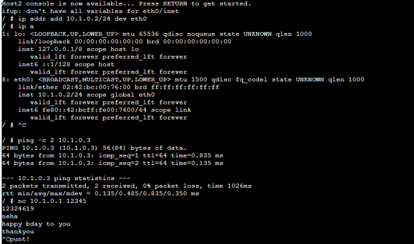    
This screenshot shows the host with its IP address configured and a successful ping to another host. I used the ping command to confirm that the hosts could communicate before testing Netcat. This helped me verify that the network connection was working correctly before moving to application-level communication    

**Successful ping between hosts**    
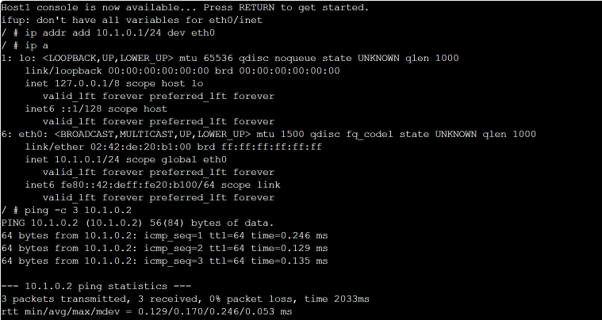   
This screenshot shows a successful ping to 10.1.0.2, with all three packets received and 0% packet loss. This confirmed that the destination host was reachable and that communication between the hosts was working correctly.    

**Multiple connectivity tests**    
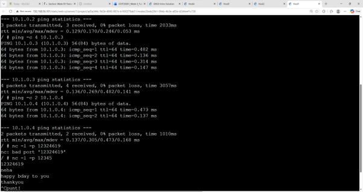    
This screenshot shows successful ping tests to different hosts, including 10.1.0.3 and 10.1.0.4. I used these tests to verify connectivity between different hosts in the LAN before performing the Netcat communication. The results showed that the hosts were reachable with no packet loss.    

**Host IP configuration**    
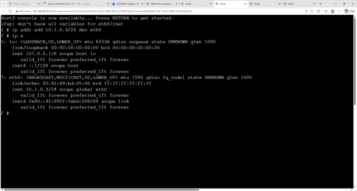    
This screenshot shows the IP address configuration of another Linux host, with eth0 assigned an address in the 10.1.0.0/24 network. This confirmed that the host was correctly configured and ready to participate in the network communication.    

**Host IP configuration**    
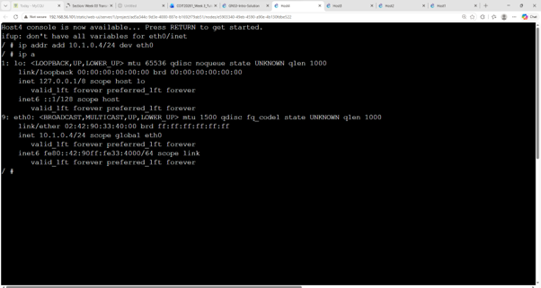    
This screenshot shows another host configured with an IP address in the same network. By checking the interface configuration, I verified that the host had a valid address and could communicate with the other hosts on the LAN.    

**GNS3 topology during packet capture setup**    
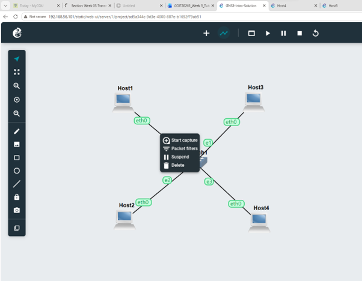    
This screenshot shows the GNS3 topology with the packet-capture option selected on the network link. I used this link to capture the packets generated during the communication tests.   

---------------------------------------

## **Task 2 — Capturing Packets**        

**Starting packet capture**   
   
This screenshot shows the GNS3 Packet capture window for the selected Ethernet link. I configured the capture and specified a .pcap file so that the packets travelling through the link could be recorded for later analysis.

**Ping packets**   
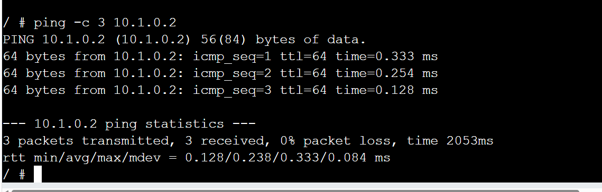    
This screenshot shows the output of a ping from one host to another, with three replies successfully received and 0% packet loss. These ping packets were part of the traffic that I generated while the packet capture was running

**Ping and Netcat traffic**    
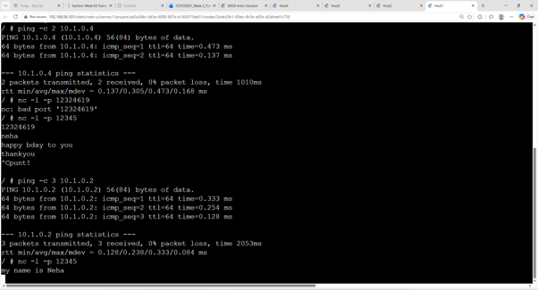    
This screenshot shows additional network communication, including successful ping results and the Netcat-related activity. I generated this traffic while the capture was active so that it could later be examined in the packet capture file.   

**Netcat message**    
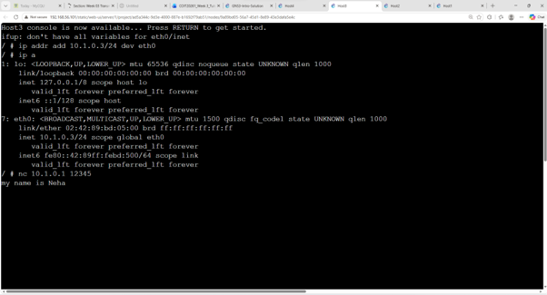    
This screenshot shows the Netcat communication where the message "my name is Neha" was sent between the hosts. This demonstrates application-level communication using Netcat and confirms that the message was successfully transmitted between the two hosts.

**FileZilla Site Manager**    
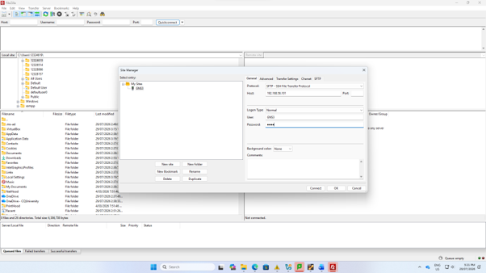    
This screenshot shows the FileZilla Site Manager configured to connect to the GNS3 server using SFTP. I used this connection to access the files stored on the GNS3 virtual machine and prepare to transfer the packet capture file to my Windows computer.    

**SFTP connection details**   
    
This screenshot shows the GNS3 SFTP connection configured with the GNS3 server address, username, and authentication details. This allowed me to establish a connection between my Windows computer and the GNS3 server so I could retrieve the .pcap file.    

**Transferring the capture file**    
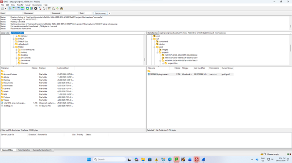    
This screenshot shows FileZilla connected to the GNS3 server, with the remote project files visible. I located the packet capture file in the GNS3 project directory and transferred it to my Windows computer for analysis.    

**Wireshark packet capture**    
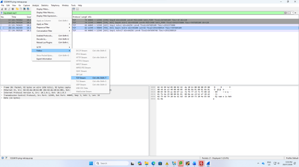    
This screenshot shows the captured packets opened in Wireshark. I examined the captured network traffic and used Wireshark's analysis features to inspect the communication recorded in the .pcap file.    

**Following the TCP stream**    
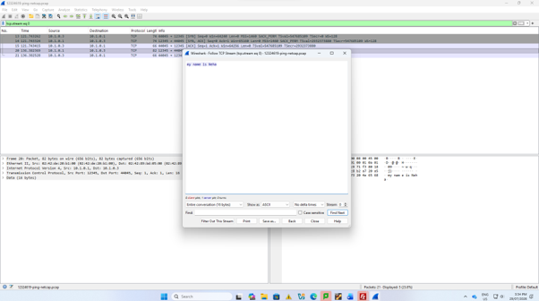    
This screenshot shows Wireshark's Follow TCP Stream feature displaying the application data captured from the Netcat communication. This allowed me to see the message transmitted through the TCP connection and understand how application data can be identified within captured network packets.

**Netcat message in Wireshark**   
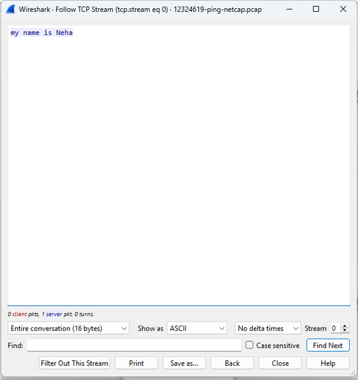   
This screenshot clearly shows the message "my name is Neha" recovered from the captured TCP stream. This demonstrates that the Netcat communication was successfully captured and that the transmitted application data can be reconstructed and viewed using Wireshark. It helped me understand the connection between application communication, packet capture, and network traffic analysis.

-------------------------------------------
