## **Task 1 — HTTP Client with GUI**    

**Network Topology**    
         
This screenshot shows the completed network topology for the HTTP GUI client. The network contains the Firefox client, two routers, switches, and the Linux server connected through three subnets. This demonstrates the network structure used for communication between the HTTP client and server.    

**GUI network topology**    
     

**noVNC**    
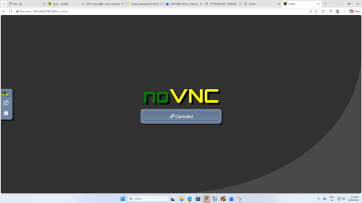    
This screenshot shows the noVNC interface used to access the graphical Host1 environment. I used noVNC to access Host1 remotely and run the Firefox web browser for the HTTP client activity.

**Firefox accessing the web server**
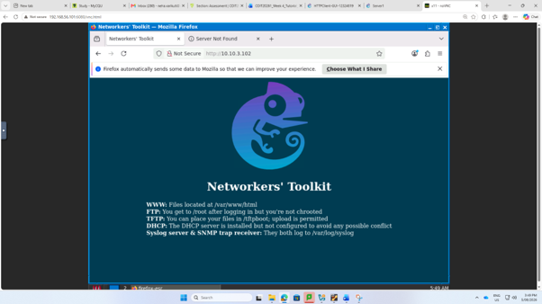    
This screenshot shows Firefox running on Host1 and successfully accessing the web server at 10.10.3.102. It demonstrates that the GUI-based HTTP client was able to communicate with the HTTP server through the configured network.    

**Packet capture configuration**    
     
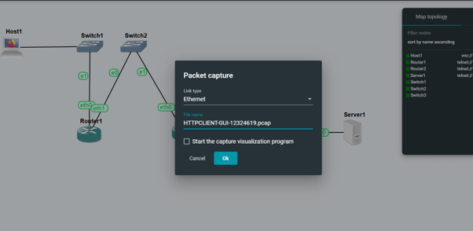    
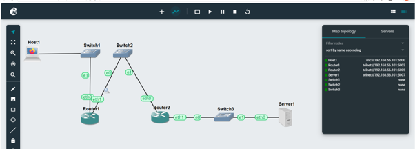    
This screenshot shows the packet capture being configured on the Ethernet link between the routers in subnet B. I selected the link and specified a .pcap file to capture the HTTP communication between the client and server.   

**FileZilla**    
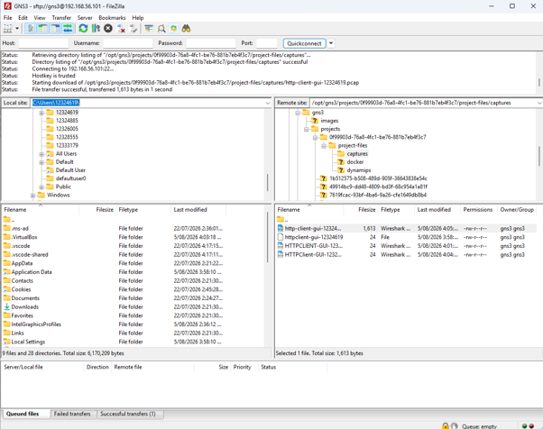    
This screenshot shows FileZilla connected to the GNS3 server and accessing the project capture directory. I used SFTP to locate the packet capture file generated by GNS3 and transfer it to my Windows computer.    

**Wireshark packet capture**    
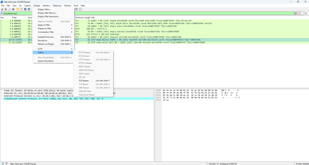    
This screenshot shows the captured network packets opened in Wireshark. The captured traffic demonstrates that packets were successfully recorded while the HTTP client communicated with the server.    

**Follow TCP Stream**    
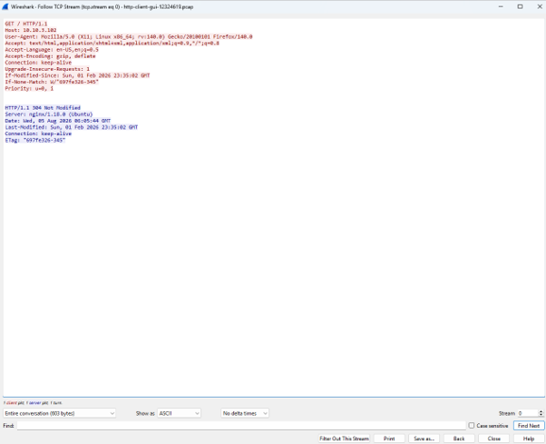    
This screenshot shows the HTTP communication using Wireshark's Follow TCP Stream feature. It allows the HTTP request and response exchanged between the client and server to be viewed together, helping me understand how HTTP communication is carried over a TCP connection.    

-------------------------------

## **Task 2 — HTTP Client with Command Line Interface**    

**CLI network topology**    
    
This screenshot shows the network topology used for the command-line HTTP client activity. The Firefox client was replaced with a Linux host while the routers, switches, and server remained connected. This setup allowed me to test HTTP communication using command-line tools.    

**ip a on Linux Host**    
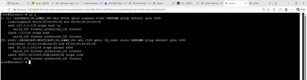   
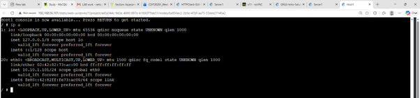    
This screenshot shows the IP configuration of the Linux host using the ip a command. It confirms that the host has been assigned an IP address and that the network interface is active before testing HTTP communication.    

**Packet capture configuration**    
    
This screenshot shows the packet capture being configured on the link between the routers in subnet B. The capture was started so that the HTTP traffic generated by the command-line client could be recorded.    

**wget**    
    
This screenshot shows the Linux host using wget to access the web server at 10.10.3.102. The successful connection and download of index.html confirm that the command-line HTTP client was able to communicate successfully with the HTTP server.    
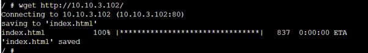   

**FileZilla**    
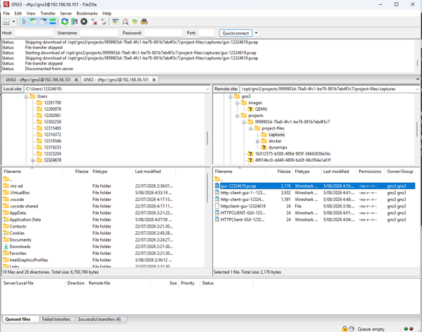    
This screenshot shows FileZilla being used to access the GNS3 project's capture directory. I located the packet capture generated during the command-line HTTP test and transferred it from the GNS3 server to my Windows computer.

**Wireshark packet list**    
    
This screenshot shows the packet capture from the command-line HTTP test opened in Wireshark. The captured packets provide evidence that network communication occurred while the Linux host accessed the HTTP server.

**.pcap file on Windows**    
    
This screenshot shows the packet capture file saved on my Windows computer after transferring it from the GNS3 server. This confirms that the required capture file was successfully obtained and stored locally.

**HTTP response in Wireshark**    
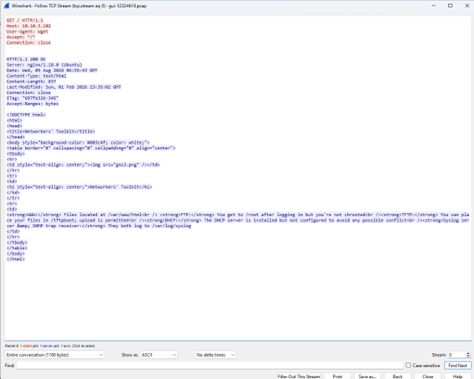    
This screenshot shows the HTTP response and HTML content captured from the web server. Examining the TCP stream helped me understand that the requested webpage is transferred from the server to the client as HTTP application data.

-------------------------------

