run the sysytem
ss6    

**Network Topology**
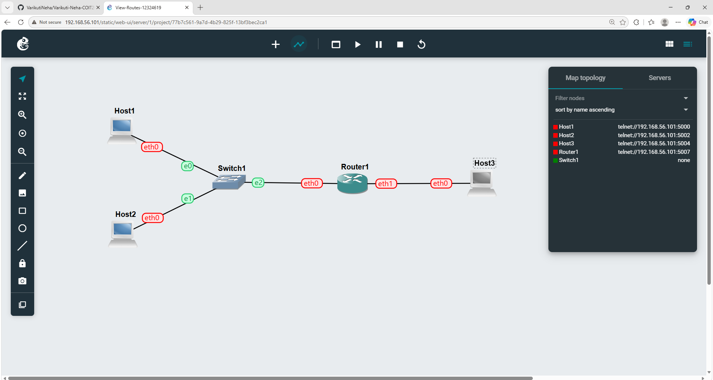    
This screenshot shows the GNS3 network topology with the hosts, router and switch connected together.    

**Switch Console**
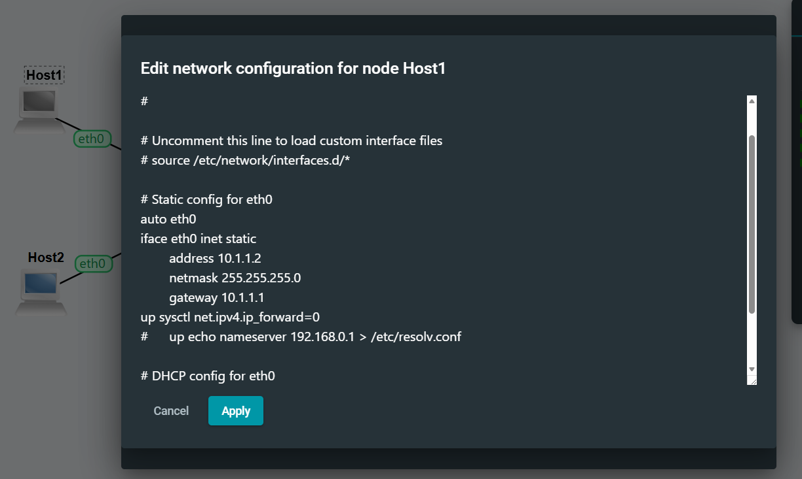    
This screenshot shows the switch console and the Open vSwitch connection status. It is part of checking and configuring the switch before continuing with the network setup.    

**Switch Port Configuration**    
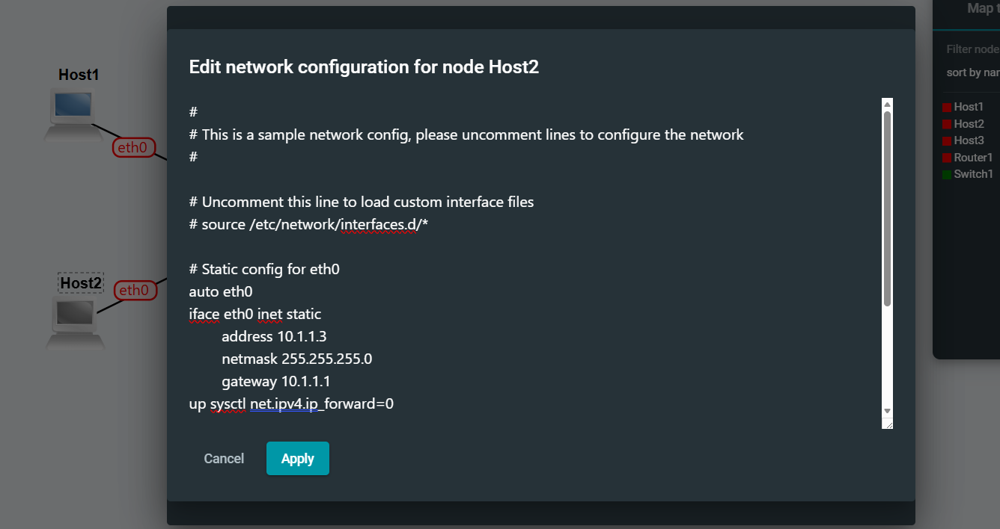    
This screenshot shows the switch port configuration where VLAN tag 10 has been assigned to the Ethernet ports. It shows the configuration applied to the switch ports.    

**Router Network Configuration**    

    
This screenshot shows the network configuration for Router1, including the IP address, subnet mask, gateway and IPv4 forwarding setting. It shows the router being configured for the routing task.    

**Successful Ping Test**    
    
This screenshot shows the successful ping test between the hosts on the network. Both destinations, 192.168.5.5 and 192.168.5.4, responded successfully with 0% packet loss, confirming that the devices were able to communicate correctly. The TTL values also helped me understand that packets were successfully travelling through the configured network. From this activity, I learned how to use the ping command to verify connectivity and troubleshoot network communication. It also confirmed that the IP addressing, routing and forwarding configuration were working as expected.    

**GNS3 Network Topology**    
    
This screenshot shows the GNS3 network topology created for the routing task. The topology contains multiple Linux hosts connected through an Ethernet switch, with a Linux router providing connectivity between different network segments. I learned how to create and connect network devices in GNS3 and understand how hosts, switches and routers work together. Configuring the topology also helped me understand the role of a router as a gateway between subnets. This activity improved my practical understanding of IP addressing, network interfaces and basic routing.    

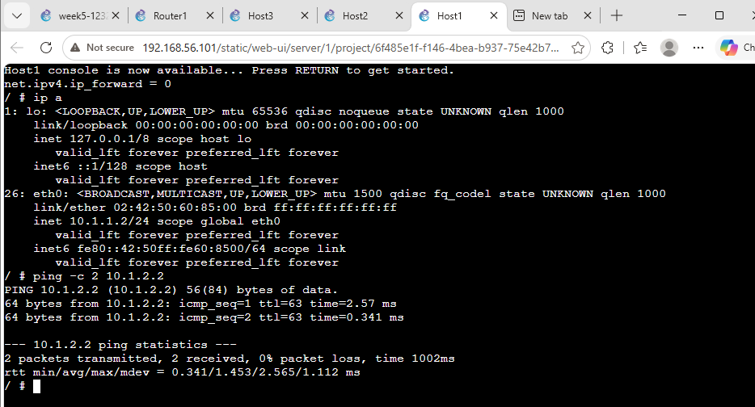
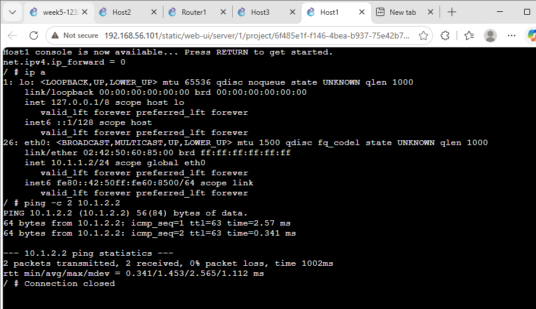
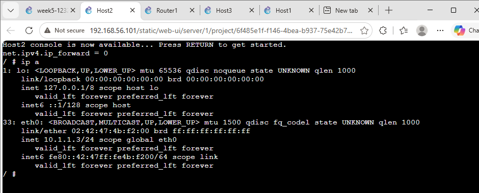
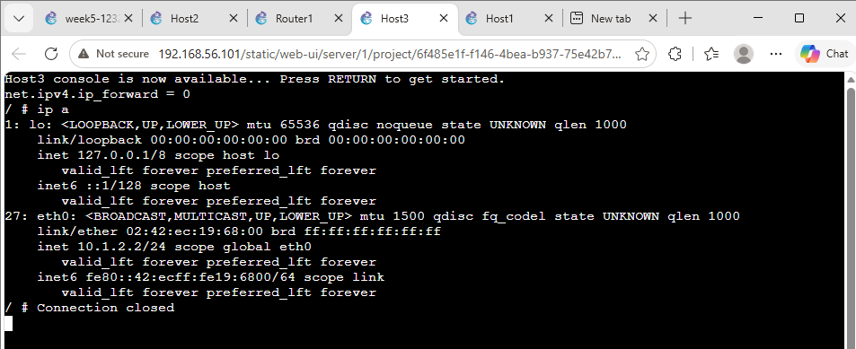
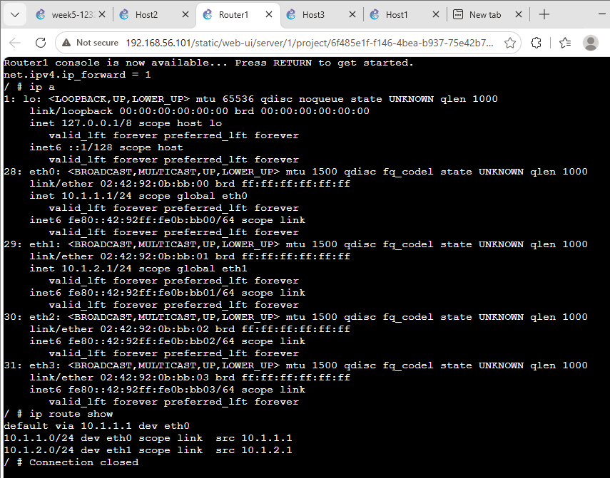

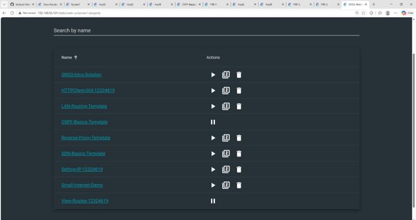
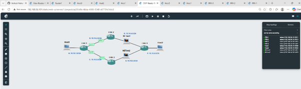

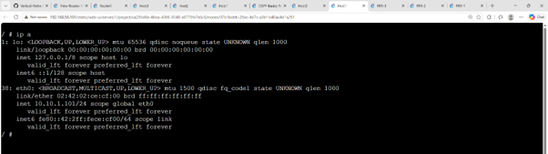
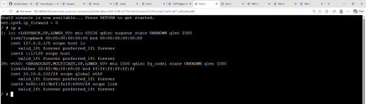

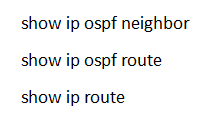
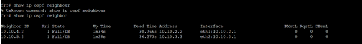
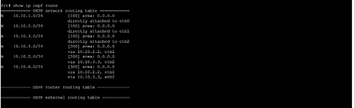
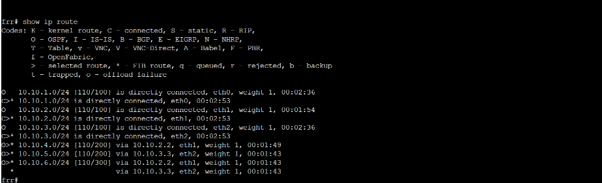
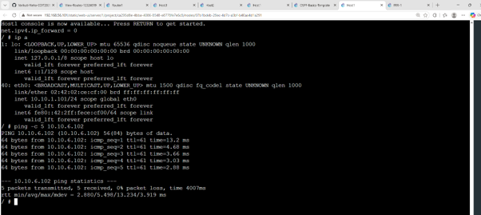
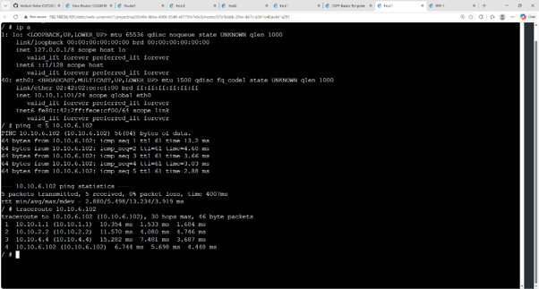
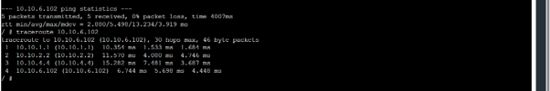

