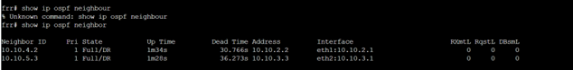
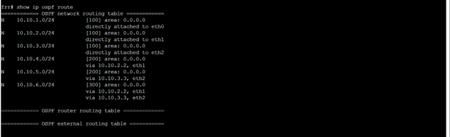
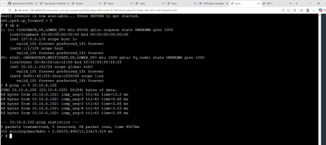
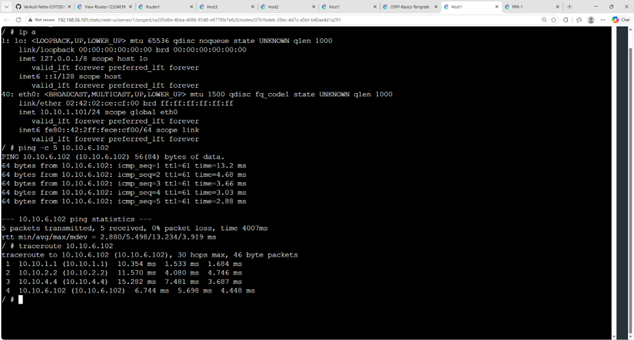

## **TASK 1: View Routing Tables**   
  
**GNS3 Network Topology**    
    
This screenshot shows the GNS3 network topology created for the routing task. The topology contains Host1 and Host2 connected to Switch1, which is connected to Router1.Router1 connects to Host3, showing how the devices communicate across two different networks.  

**Host_1 IP Address**    
    

I checked the IP configuration of Host 1 using the ip a command. The screenshot shows that Host 1 has the address 10.1.1.2/24. This helped me confirm which subnet the host belongs to before testing communication.    

**Host_2 IP Address**   
    
I checked the IP configuration of Host 2 and found the address 10.1.1.3/24. Host 1 and Host 2 are therefore on the same 10.1.1.0/24 network. This made it easier for me to understand their position in the topology.    

**Host_3 IP Address**    
    
I checked the IP configuration of Host 2 and found the address 10.1.1.3/24. Host 1 and Host 2 are therefore on the same 10.1.1.0/24 network. This made it easier for me to understand their position in the topology.    

**Router Interface and Forwarding**    
    
I checked the router interfaces and forwarding setting. The router has addresses on both 10.1.1.0/24 and 10.1.2.0/24, and the forwarding value is 1. This confirmed to me that the router is set up to forward packets between the two subnets, and I checked on the router again and confirmed that IPv4 forwarding is enabled with a value of 1. This was important because without forwarding, the router would not be able to pass packets from one subnet to the other.

**Routing table**    
    
I used ip route show to view the routing table. The output shows the connected 10.1.1.0/24 and 10.1.2.0/24 networks. I learned that the routing table gives the router information about where packets for different networks should be sent.   

-----------------------------------------

## **TASK2: Dynamic Routing with OSPF **    

**GNS3 project list**
    
This screenshot shows the GNS3 project list, including the OSPF-Basics-Template and the View-Routes project. I used this to locate the project needed for the dynamic routing activity.    

**OSPF network in GNS3**
    
I opened the OSPF network in GNS3 and checked the overall topology. I could see the hosts, routers and NETem nodes connected together. This gave me a clear view of the network before checking the routing information   

**OSPF commands**    
    
I recorded the three FRR commands used for the routing activity: show ip ospf neighbor, show ip ospf route and show ip route. These commands gave me different views of the OSPF neighbours and routing tables.    

**OSPF neighbours**
    
I used show ip ospf neighbor to check the routers connected to FRR1. The output shows two neighbours with Full/DR state. This helped me understand how OSPF routers establish neighbour relationships.    

**OSPF routing table**    
     
I used show ip ospf route to view the networks learned by OSPF. The output shows directly connected networks as well as remote networks reached through other routers. I could see that the destination 10.10.6.0/24 had two possible paths.    

**Linux/FRR routing table**    
    
I checked the full routing table using show ip route. The output includes directly connected networks and OSPF routes, such as the routes to 10.10.4.0/24, 10.10.5.0/24 and 10.10.6.0/24. This helped me understand how OSPF information is used for forwarding.    

**Ping to Host 2**
    
I tested connectivity from Host 1 to 10.10.6.102 using ping. All five packets were received with 0% packet loss. This confirmed that Host 1 could successfully reach Host 2 through the OSPF network.    
**Ping and first traceroute**    
    
After confirming the ping was successful, I used traceroute to see the path to Host 2. The path shown goes through 10.10.1.1, 10.10.2.2 and 10.10.4.4 before reaching 10.10.6.102. This made the routing path easier for me to understand.    

**traceroute output**
    
This screenshot clearly shows the first traceroute result. The packets reached Host 2 through 10.10.2.2 and then 10.10.4.4. I used this result as the path to compare with the route after the network link was disconnected.

**GNS3 topology**
    
I checked the GNS3 topology after changing the network path. The routers, hosts and NETem nodes are still visible, which helped me verify the state of the network before finishing the test.

**Traceroute comparison**    
    
This screenshot shows the two traceroute results together. The path changes from the route through 10.10.2.2 to the route through 10.10.3.3. This was the main result I wanted to observe from the dynamic routing activity.

--------------------------------------------------
